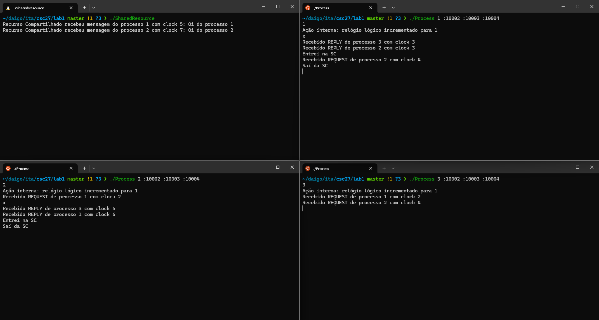
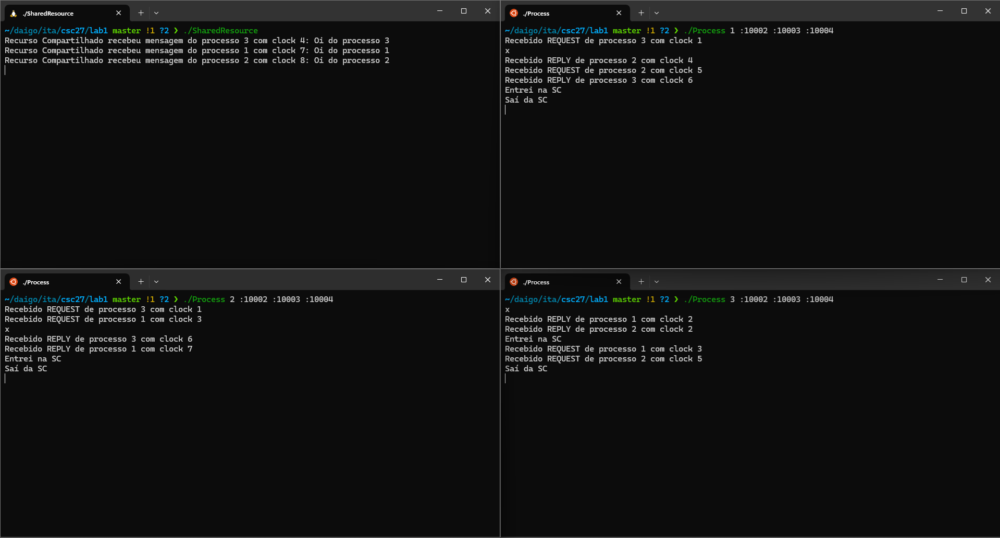

# Desenvolvimento e Implementação do Algoritmo de Ricart-Agrawala

O objetivo é permitir que múltiplos processos acessem uma seção crítica (SC) de forma mutuamente exclusiva em um ambiente distribuído, utilizando comunicação por mensagens e relógios lógicos escalares.

## Descrição do Algoritmo

O algoritmo de Ricart-Agrawala é um protocolo de exclusão mútua distribuída que elimina a necessidade de um coordenador central. Ele funciona com base em mensagens de solicitação (`REQUEST`) e resposta (`REPLY`) trocadas entre os processos, juntamente com o uso de relógios lógicos para ordenar eventos no sistema.

### Funcionamento Geral

1. Solicitação de Acesso à Seção Crítica:
  - Quando um processo deseja entrar na SC, ele incrementa seu relógio lógico e envia uma mensagem `REQUEST` para todos os outros processos, incluindo o timestamp atual.

2. Recebimento de Solicitações:
  - Ao receber um `REQUEST`, o processo receptor compara o timestamp da solicitação com o seu próprio.
  - Se o processo receptor não estiver interessado na SC ou se a solicitação recebida tiver prioridade (timestamp menor ou, em caso de empate, ID menor), ele envia um `REPLY` imediatamente.
  - Caso contrário, ele adia o `REPLY` até liberar sua própria SC.

3. Entrada na Seção Crítica:
  - Após receber todos os `REPLY`, o processo solicitante entra na SC, garantindo exclusão mútua.

4. Liberação da SC
  - Ao sair da SC, o processo envia todos os `REPLY` que estavam adiados para os processos que os solicitaram.

## Implementação

### Estrutura Geral

O sistema consiste em dois principais componentes:

1. Processos (`Process.go`): Implementam o algoritmo de Ricart-Agrawala, gerenciam o relógio lógico e coordenam o acesso à SC.

2. Recurso Compartilhado (`SharedResource.go`): Representa a seção crítica, recebendo mensagens dos processos que obtiveram acesso.

### Principais componentes do código

A estrutura `Message` define o formato das mensagens trocadas entre os processos:

```go
type Message struct {
    Type     string // "REQUEST", "REPLY" ou "CS" (para o SharedResource)
    From     int    // ID do processo remetente
    Clock    int    // Relógio lógico do remetente
    Text     string // Texto da mensagem (opcional)
}
```

A função `ìnitiConnections()` configura a porta do processo atual com base nos argumentos de linha de comando e as conexões UDP para comunicação com outros processos e com o `SharedResource`.

A função `doServerJob()` escuta mensagens UDP e despacha para `handleRequest()` ou `handleReply()` conforme o tipo.

A função `handleRequest()` decide se envia um `REPLY` imediato ou adia, baseado na prioridade (timestamp e ID).

A função `handleReply()` incrementa `replyCount` e sinaliza quando todos os `REPLY` foram recebidos.

## Testes e validação

- Cenário com 3 Processos:
  - Executamos o SharedResource e três instâncias de Process.go com IDs 1, 2 e 3.
  - Verificamos que apenas um processo por vez entra na SC.
  - Testamos solicitações simultâneas de acesso à SC.

- Observação dos Relógios Lógicos:
  - Acompanhamos os valores dos relógios lógicos nos logs.
  - Confirmamos que os relógios são atualizados corretamente conforme as mensagens são trocadas.

- Validação:
  -Garantimos que o `SharedResource` recebe mensagens de um processo por vez.

## Compilando e executando

Para complilar os arquivos em go:

```bash
   go build Process.go
   go build SharedResource.go
```

Para executar e testar, rode cada comando em um terminal diferente:

```bash
   ./SharedResource 
   ./Process 1 :10002 :10003 :10004 
   ./Process 2 :10002 :10003 :10004 
   ./Process 3 :10002 :10003 :10004 
```

## Teste

- Solicitar acesso ao SC:
  - Digitar `x` no terminal de um dos processos.

- Realizar uma ação interna:
  - Digite o ID do processo no seu próprio teminal.
  - Exemplo: No terminal do `./Precess 1` digite `1`.

### Teste 1

Elabore um caso trivial com um processo solicitando a CS e, depois que ele liberar, outro processo solicita a CS.


### Teste 2

Elabore um caso em que um processo solicita a CS enquanto outro processo está usando a CS.



### Teste 3

Elabore um caso que caia especificamente na condição “state=WANTED and (T,pj)<(Ti,pi)”. A ideia é mostrar que um processo que pediu a CS antes, terá a pre ferência.



Note que foi chamado primeiro o processo 3, antes de sair do SC foi chamado o processo 1 e 2. E o SC respeitou a preferencia.