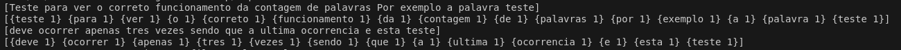
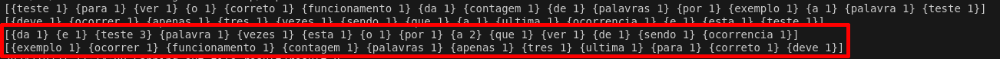

# Parte 1: Implementação Sequencial

## Função mapFunc

```go
func mapFunc(input []byte) (result []mapreduce.KeyValue) {
    text := string(input)

    words := strings.FieldsFunc(text, func(c rune) bool {
        return !unicode.IsLetter(c) && !unicode.IsNumber(c)
    })

    result = make([]mapreduce.KeyValue, 0)

    for _, word := range words {
        word = strings.ToLower(word)
        kv := mapreduce.KeyValue{Key: word, Value: "1"}
        result = append(result, kv)
    }

    return result
}
```

- Conversão do Chunk: Transforma os bytes em string para processamento.
- Divisão em Palavras: Utiliza strings.FieldsFunc com um delimitador personalizado.
- Normalização: Converte as palavras para minúsculas.
- Emissão dos Pares: Cada palavra é associada ao valor "1".

### Teste da função mapFunc

```bash
    $ ./wordcount -mode sequential -file files/teste.txt -chunksize 100 -reducejobs 2
```



O arquivo de texto foi dividido em pedaços de 100 bytes, conforme especificado pelo parâmetro chunksize. Cada um desses pedaços foi processado de forma independente. Para cada pedaço, a função mapFunc é chamada, onde o conteúdo do pedaço é lido e cada palavra é identificada, convertida para minúsculas, e associada ao valor 1, indicando que a palavra apareceu uma vez.

## Função reduceFunc

```go
    func reduceFunc(input []mapreduce.KeyValue) (result []mapreduce.KeyValue) {
    mapAux := make(map[string]int)

    for _, item := range input {
        value, err := strconv.Atoi(item.Value)
        if err != nil {
            continue
        }
        mapAux[item.Key] += value
    }

    result = make([]mapreduce.KeyValue, 0, len(mapAux))
    for key, count := range mapAux {
        kv := mapreduce.KeyValue{Key: key, Value: strconv.Itoa(count)}
        result = append(result, kv)
    }

    return result
    }
```

- Agrupamento: Utiliza um mapa auxiliar para acumular as contagens.
- Conversão de Valores: Converte os valores de string para inteiro.
- Construção do Resultado: Cria uma lista de pares chave-valor com as contagens finais.

### Teste da funcao reduceFunc

```bash
    $ ./wordcount -mode sequential -file files/teste.txt -chunksize 100 -reducejobs 2
```



A função `reduceFunc` desempenha o papel de consolidar os resultados intermediários gerados pela fase de mapeamento no MapReduce. No caso do problema de contagem de palavras, o `reduceFunc` recebe como entrada uma palavra (chave) e uma lista de valores que representam o número de vezes que essa palavra foi encontrada em diferentes partes do arquivo durante a fase Map. O funcionamento da função consiste em percorrer essa lista de valores e somar todas as ocorrências da palavra associada, gerando um par chave-valor final onde a chave é a palavra e o valor é o total de ocorrências. Por exemplo, a palavra "teste", que aparece três vezes no total (duas vezes no primeiro chunk e uma vez no segundo), será somada para resultar em {teste, 3}, como pode ser visto na figura acima. Ao final da fase de redução, todas as palavras são agregadas e cada uma tem sua contagem totalizada de acordo com os dados recebidos da fase Map. Esse processo garante que todas as palavras encontradas no arquivo tenham suas contagens combinadas e corretamente consolidadas para a saída final.

## Variação de `chunksize` e `reducejobs`

### Experimento 1: Variando chunksize

Configuração A: 
```bash
    ./wordcount -mode sequential -file files/pg1342.txt -chunksize 1024 -reducejobs 2
```
- Observações:
  - O arquivo foi dividido em chunks de 1 KB.
  - Número maior de tarefas de map.

Configuração B:
```bash
    ./wordcount -mode sequential -file files/pg1342.txt -chunksize 4096 -reducejobs 2
```
- Observações:
  - Chunks de 4 KB.
  - Menos tarefas de map.

Análise:
- Desempenho:
  - Com chunks menores, há mais paralelismo potencial, mas também maior sobrecarga na criação de tarefas.
  - Com chunks maiores, a sobrecarga é reduzida, mas cada tarefa processa mais dados.